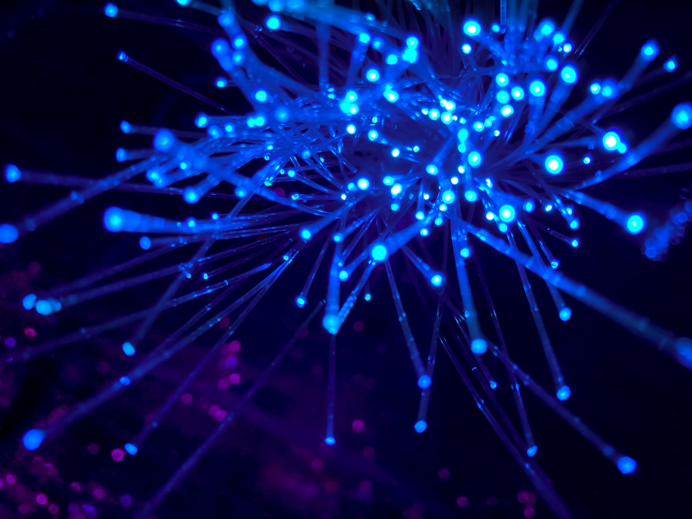

This is electron brain.

Photo by [JJ Ying](https://unsplash.com/@jjying?utm_source=unsplash&utm_medium=referral&utm_content=creditCopyText) on [Unsplash](https://unsplash.com/s/photos/network?utm_source=unsplash&utm_medium=referral&utm_content=creditCopyText)

It has lobes:

- [[frontal lobe]]
- [[temporal lobe]]
- [[parietal lobe]]
- [[occipital lobe]]
- [[new brain part]]

More info [[about]] this brain.

[[example note]]
